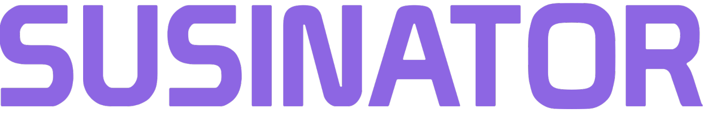

  
   

_**Your AI Contract Manager**_

Susinator is a comprehensive contract analysis tool that leverages AWS Lambda, S3 buckets, SageMaker, and DynamoDB. It not only extracts and highlights critical clauses within contracts but also provides concise summaries. Additionally, it identifies legal obligations and bindings, empowering users with a clear understanding of their contractual commitments.

## Mission Statement

The inspiration behind Susinator stemmed from the need to revolutionize contract management. Recognizing the complexity and time-consuming nature of analyzing legal documents, we aimed to create a solution that could automate this process, making it more efficient and accessible for users.

☁️ **Susinator was made possible thanks to Amazon Cloud Services** ☁️

  

  
  

## Key Features

- **Custom-Trained AWS SageMaker Model:** Harness the power of AWS SageMaker to train a custom model tailored to interpret and analyze contractual documents, extracting essential information such as employer name, salary, salary disbursement frequency, and, in the near future, detailed benefits information.

- **AWS Lambda for Real-Time Processing:** Utilize AWS Lambda for on-demand, real-time processing of contract documents, enabling swift analysis and summary generation without the constraints of server capacities.

- **Transition from RapidAPI:** Migrate away from the limitations of RapidAPI to a more robust and customizable infrastructure, allowing for greater flexibility in processing and analyzing legal documents.

- **Benefits Analysis Expansion:** With the integration of SageMaker, broaden the scope of analysis to include a thorough breakdown of benefits provisions within contracts, providing users with a comprehensive understanding of their contractual entitlements.

- **Secure Document Upload and Storage:** Ensure the confidentiality and integrity of user-uploaded documents through secure upload channels and encrypted storage solutions.

- **Interactive Summary Dashboard:** Offer users an intuitive dashboard where they can interact with the summarized information, delve into specific contract clauses, and receive personalized insights on potential areas of concern.

- **User Feedback Loop for Continuous Improvement:** Implement a user feedback mechanism to continually refine the model's accuracy and the app’s functionality based on real-world usage and feedback.

- **Community-Driven Clause Clarifications:** Establish a community-driven platform where users can contribute clarifications on complex or ambiguous contract clauses, fostering a collaborative environment for demystifying legal documents.

- **API for Third-Party Integrations:** Provide an API for seamless integration with third-party platforms, enabling users to directly import/export contracts from other tools and services.

- **Educational Resources on Contractual Terms:** Offer a rich repository of educational resources to help users better understand common contractual terms, conditions, and implications.

## Future Development 

## How to Run this WebApp:

1. ``git clone <repository_URL>`` onto your machine
2. Set up your AWS Credentials
3. Connect your AWS S3 Bucket
    - Put ``NEXT_PUBLIC_AWS_ACCESS_KEY_ID_1``, ``NEXT_PUBLIC_AWS_SECRET_ACCESS_KEY_1``, and ``NEXT_PUBLIC_AWS_BUCKET_REGION_1``in ``.env.local`` (in root of frontend folder)
5. cd SunHacks23
6. run the frontend
    - cd frontend
    - npm install
    - npm run dev
7. run the backend
    - cd Backend
    - python server.py
8. Open a web browser and go to `localhost:3000` to access the application

## Created By
_**Anmol Rao, Gavin Holtzapple, Taman Truong, Harish Chaurasia & Chaitanya Chaurasia**_
